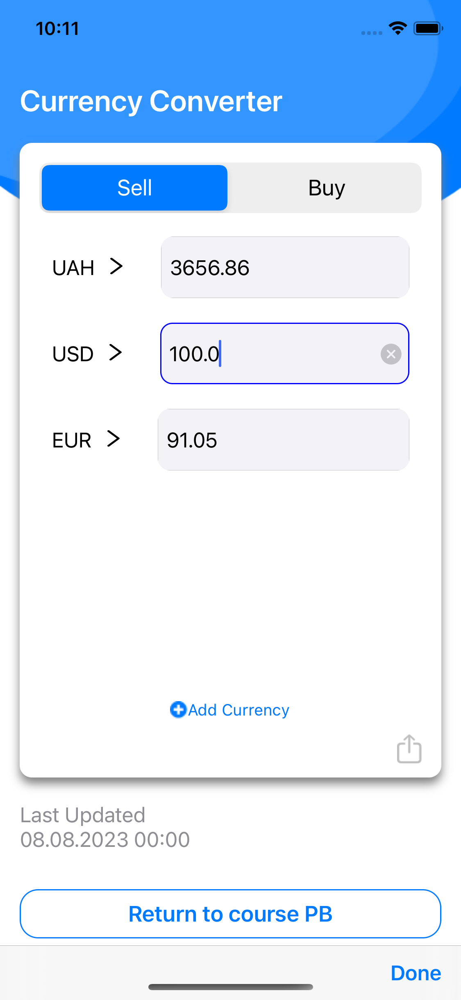
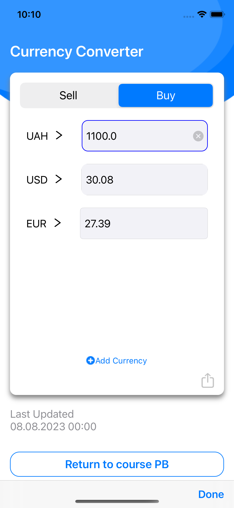
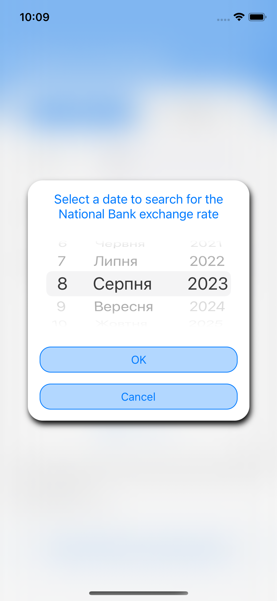
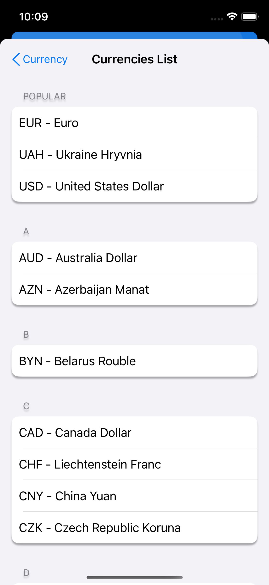
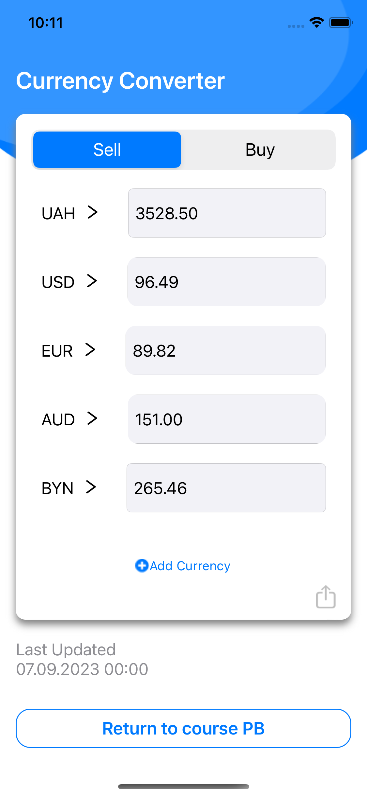
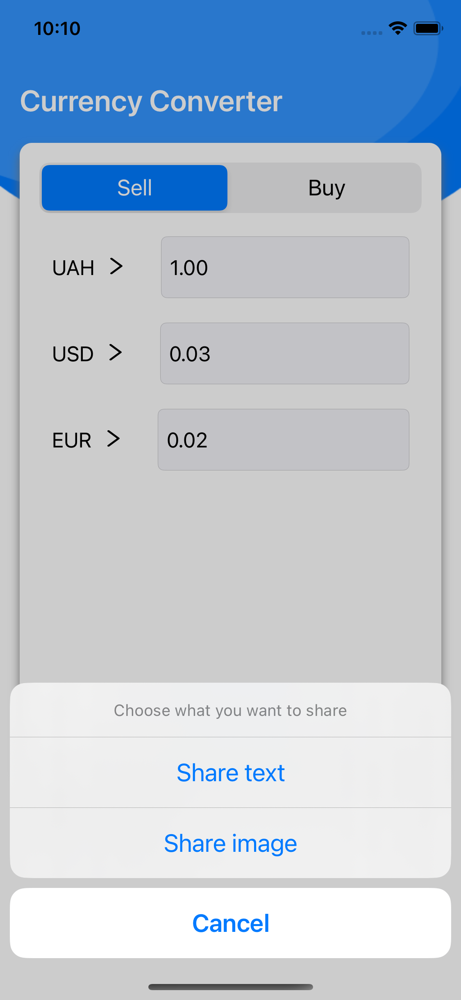

# Image Search App
Application for quick assessment of the current exchange rate.

## Content
- [Technologies](#technologies)
- [Additionally](#additionally)
- [Screenshots](#screenshots)
- [Contributing](#contributing)

## Technologies
- Swift
- UIKit
- Code-only layout
- Auto Layout
- WebKit
- MVC
- Without storyboard
- URLSession
- Codable
- Repository pattern
- UNIT/UI Tests

## Additionally
Buy/sell rate relative to 2-3 major foreign currencies in the country. First – country currency.
If the course was updated during the specified time period, the application works offline (used CoreData).
Ability to share the exchange rate of selected currency to country currency in messengers.

## Screenshots:

    

  

## Contributing
If you find a bug or remark in the code or when the program is running, please email me:
<a href="mailto:olga.sabadina@icloud.com">olga.sabadina@icloud.com</a>

### Why did I write this project?
___
This app was developed with the help of the knowledge gained during the mentoring course on [Foxminded](https://foxminded.ua)  Swift

